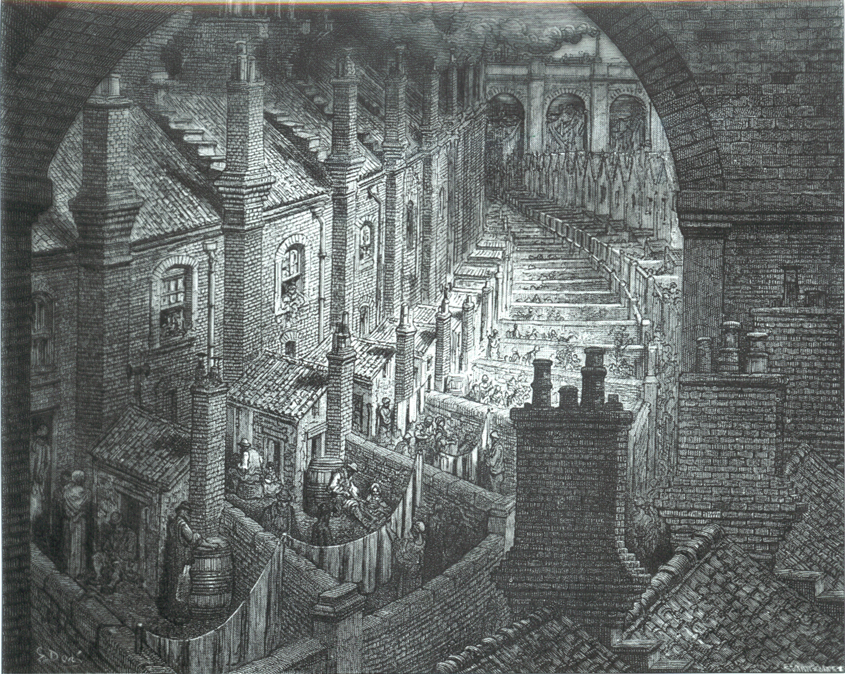
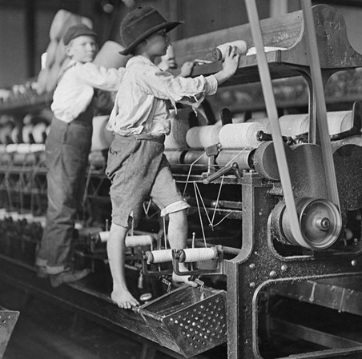
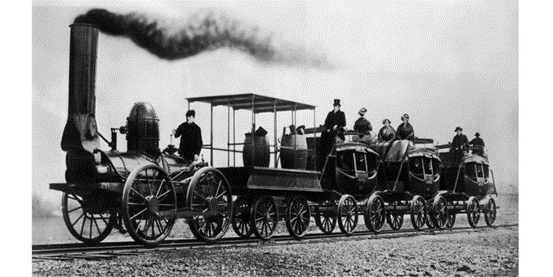

# DQB Industrial Revolution
## 1750 - 1900

## AP Euro Mr. LaPratt
## The Industrial Revolution

### Directions: The following question is based on the accompanying Documents 1 - 11. (The documents have been edited for the purpose of this exercise.)

#### This question is designed to test your ability to work with and understand historical documents. Write an essay that:
-	Has a relevant thesis and supports that thesis with evidence from the documents.
-	Uses all documents.
-	Analyzes the documents by grouping them in as many appropriate ways as possible. Does not simply summarize the documents individually.
-	Takes into account both the sources of the documents and the author’s points of view.
#### You may refer to relevant historical information not mentioned in the documents.

## Question: What were the positive and negative effects of the Industrial Revolution? What additional document(s) would help you in your analysis?

## Document One
The following excerpt is from a British industrial worker named William Cooper who testified before the Sadler Committee in 1832. The Sadler Committee was investigating the working conditions in British factories.

	Sadler: What is your age?
	Cooper: I am eight and twenty.
	Sadler: When did you first begin to work in the mills?
	Cooper: When I was ten years of age.
	Sadler: What were your usual hours of working?
	Cooper: We began at five in the morning and stopped at nine at night.
	Sadler: What time did you have for meals?
	Cooper: We had just one period of forty minutes in the sixteen hours. That was at noon.
	Sadler: What means were taken to keep you awake?
	Cooper: At times we were frequently strapped [whipped].
	Sadler: When your hours were so long, did you have any time to attend a day school?
	Cooper: We had no time to go to day school.
	Sadler: Can you read and write?
	Cooper: I can read, but I cannot write.

## Document Two

The following excerpt is from Joseph Hebergam another worker who testified before the Sadler Committee in 1832.

	Sadler: What is the nature of your illness?
	Hebergam: I have damaged lungs. My leg muscles do not function properly and will not	support the weight of my bones.
	Sadler: A doctor has told you that you will die within a year, is that correct?
	Hebergam: I have been told so.
	Sadler: Did he tell you the causes of your illness?
	Hebergam: He told me it was caused by the dust in the factories and from overwork and	insufficient diet …
	Sadler: To what was his [your brother’s] death attributed?
	Hebergam: He was cut by a machine and died of infection.
	Sadler: Do you know of any other children who died at the R__________ Mill? [the name of	the mill was withheld from the printed testimony]
	Hebergam: There was about a dozen who died during the two and a half years I was there. At	the L___________ Mill where I worked last, a boy was caught in a machine and both	his thigh bones broke and from his knee to his hip the flesh was ripped up the same	as if it had been cut by a knife. His hands were bruised, his eyes were nearly torn out	and his arms were broken. His sister, who ran to pull him off had both her arms broke	and her head bruised. The boy died. I don not know if the girl is dead, but she was	not expected to live.
	Sadler: Did the accident occur because a shaft was not covered?
	Hebergam: Yes.

## Document Three

The following is an excerpt from Andrew Ure’s book The Philosophy of Manufactures published in 1835.

	I have visited many factories, both in Manchester and in surrounding districts, and I never saw a single instance of corporal chastisement [beating] inflicted on a child. They seemed to be always cheerful and alert, taking pleasure in the light play of their muscles … as to exhaustion, they showed no trace of it on emerging from the mill in the evening; for they began to skip about … it is moreover my firm conviction that children would thrive better when employed in our modern factories, than if left home in apartments too often ill-aired, damp and cold.

## Document Four

From Charles Knight’s The Working Man’s Companion subtitled The Results of Machinery, Namely Cheap Production and Increased Employment published in 1831. The book was intended to instruct workers about the benefits of industrialization after failed political riots in Bristol, England.

	You are surrounded, as we have constantly shown you throughout this book, with an infinite number of comforts and conveniences which had no existence two or three centuries ago and those comforts are nit used by a few, but are within reach of almost all men. Every day is adding something to your comforts. Your houses are better built, your clothes are cheaper, you have an infinite number of domestic utensils. You can travel cheaply from place to place and not only travel at less expense, but travel ten times quicker than almost two hundred years age.

## Document Five

The following description is from a pamphlet, published in 1797, by the Society for Bettering the Condition and Increasing the Comforts of the Poor.

	The village contains about 1500 inhabitants, of whom all are capable of the work are employed in and about the mills. Of these there are 500 children who are entirely fed, clothed, and educated by Mr. Dale. The others live with their parents in the village and have a weekly allowance for their work. The healthy appearance of these children has frequently attracted the attention of the traveler. Special regulations, adopted by Mr. Dale, have made this factory very different from the others in this kingdom. Out of the nearly 3000 children employed in the mills from 1785 to 1797, only fourteen have died. 

## Document Six

The following excerpt is from the French politician and economist Leon Faucher. Faucher visited several English cities in 1843 examining their social system and recorded his observations in a book entitled Manchester in 1844.

	The little town of Hyde was, at the beginning of the century, a little hamlet of only 800 people, on the summit of a barren hill, the soil of which did not yield sufficient food for the inhabitants. The brothers Ashton have peopled and enriched the desert … Mr. T. Ashton emplys 1500 workers [in his factories]. The young women are well and decently clothed … the houses inhabited by the work people form long and large streets. Mr. Ashton has built 300 of them, which he lets [rents] for 75 cents per week and … everywhere is to be observed a cleanliness which indicates order and comfort.

## Document Seven

The Conditions of the Working Class in England by the German socialist Friedrich Engels, published in 1844. 

	Every great town has one or more slum areas where workers struggle through life as best they can out of sight of the more fortunate classes of society. The slums … are generally an unplanned wilderness of one – or two – storied houses. Wherever possible these have cellars which are also used as dwellings. The streets are usually unpaved, full of holes, filthy and strewn with refuse. Since they have neither gutters nor drains, the refuse accumulates in stagnant, stinking puddles. The view of Manchester is quite typical. The main river is narrow, coal-black and full of stinking filth and rubbish which deposits on the bank … one walks along a very rough path on the river bank to reach a chaotic group of little one-storey, one room cabins … in front of the doors, filth and garbage abound …

## Document Eight

Letter from the Leeds Cloth Merchants, 1791, was issued by the Cloth Merchants of the English city of Leeds. The merchants were replying to a letter criticizing the use of machines published by the Leeds Woolen Workers.

	… the Cloth Merchants of Leeds, who depend chiefly on a foreign demand, where they have for competitors the manufactures of other nations, whose taxes are few, and whose manual labour is only half the price it bears here, should have occasion to defend … the advantages derived to every flourishing manufacture from the application of machinery; they instance that of cotton in particular, which in its internal and foreign demand is nearly alike to our own, and has in a few years by the means of machinery advanced to its present importance … in the manufacture of woolens, the scribbling mill, the spinning frame, and the flying shuttle, have reduced manual labour nearly one third, and each of them has at its first introduction carried an alarm to the work people, yet each has contributed to the advance of wages and to increase the trade so that if an attempt was now made to deprive us of the use of them, there is no doubt, but every person engaged in business would exert himself to defend them.

## Document Nine

The following picture is of a typical working class neighborhood in London, England ca. 1872.

## Document Ten

## Document Eleven

